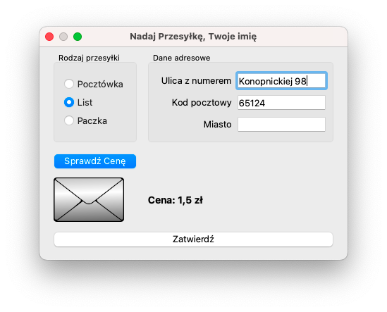
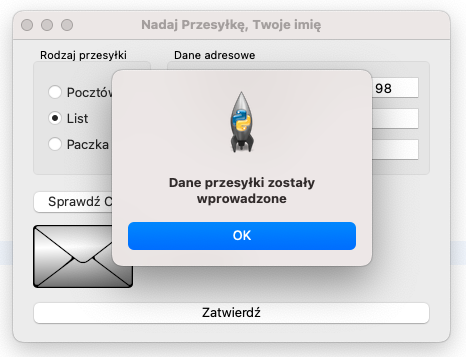
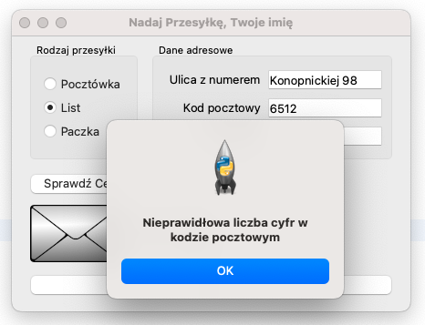
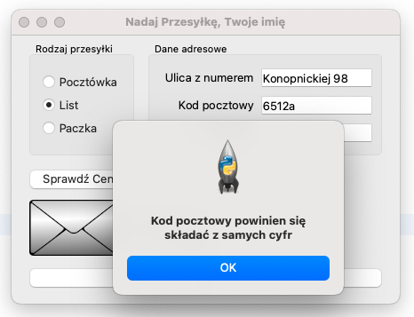

### Treść zadania - 5 pkt.
Z zastosowaniem biblioteki PySide6 napisz aplikację do obsługi poczty. Przykładowy wygląd aplikacji przedstawiono na screenie poniżej. Wykorzystaj materiały dołączone do zadania.

### Opis wyglądu aplikacji
Okno dialogowe o nazwie „Nadaj Przesyłkę” i szerokości dopasowanej do kontrolek wewnątrz. W nazwie okna należy wstawić także swoje imię.
Okno zawiera kontrolki rozmieszczone zgodnie ze screenem:
- grupa pól radio: Pocztówka, List, Paczka, pola są zgrupowane w dowolny dostępny element grupujący (np. GroupBox), w stanie początkowym zaznaczone jest pole Pocztówka
- trzy pola edycyjne poprzedzone etykietami o treści „Ulica z numerem”, „Kod pocztowy”, „Miasto”, zgrupowane w dowolny dostępny element grupujący
- przycisk o treści „Sprawdź Cenę”
- obraz w stanie początkowym wyświetlający obraz pocztowka.png
- etykieta o treści „Cena: ”, o cechach: napis pogrubiony i czcionka widocznie większa względem pozostałych napisów
- przycisk o treści: „Zatwierdź”

### Działanie aplikacji
1. Pola radio działają w grupie, jednocześnie może być wybrane tylko jedno pole
2. Po wybraniu przycisku „Sprawdź cenę” aplikacja sprawdza, które pole radio jest zaznaczone i zależnie od wyboru wyświetla odpowiedni dla pola obraz oraz cenę, odpowiednio:
   - pole radio Pocztówka: obraz pocztowka.png, „Cena: 1 zł” 
   - pole radio List: obraz list.png, „Cena: 1,5 zł” 
   - pole radio Paczka: obraz paczka.png, „Cena: 10 zł”
3. Po wybraniu przycisku „Zatwierdź” jest walidowane pole kodu pocztowego oraz wyświetlany komunikat. Dla uproszczenia zadania należy przyjąć, że kod składa się tylko z 5 cyfr (bez znaku '-').
   - komunikat dla poprawnego kodu pocztowego: „Dane przesyłki zostały wprowadzone”
   - komunikat, gdy jest mniej lub więcej niż 5 znaków: „Nieprawidłowa liczba cyfr w kodzie pocztowym” 
   - komunikat, gdy przynajmniej jeden znak nie jest cyfrą: „Kod pocztowy powinien się składać z samych cyfr”

### Założenia aplikacji
1. Pliki obrazów zapisane w zasobach aplikacji - 1 pkt.
2. Aplikacja obsługuje dwa zdarzenia: kliknięcie dla każdego z przycisków - 1,5 pkt.
3. Po wybraniu przycisku Zatwierdź aplikacja jedynie wyświetla komunikat. Nie jest wymagane, aby dane z okna zostały zapisane do struktury w programie. 1,5 pkt.
4. Aplikacja powinna być zapisana czytelnie, z zachowaniem zasad czystego formatowania kodu, należy stosować znaczące nazwy zmiennych i funkcji - 1 pkt.

